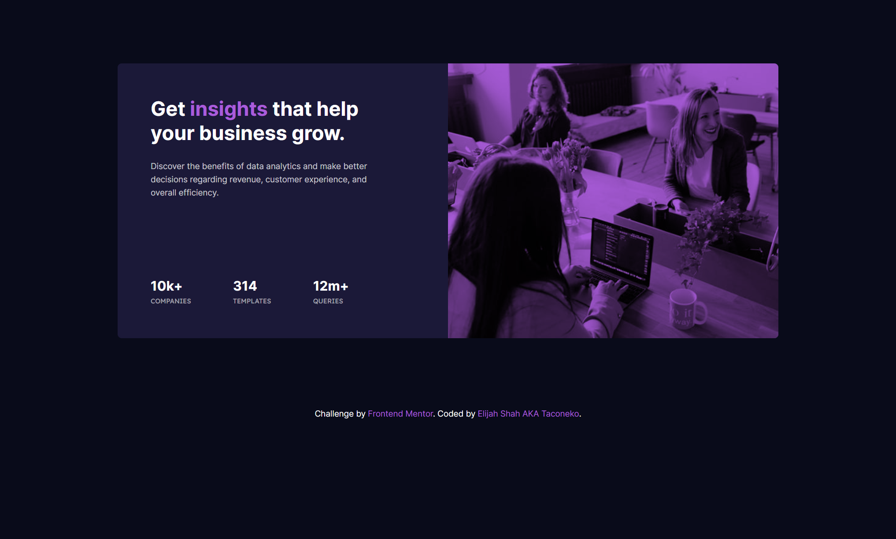

# Frontend Mentor - Stats preview card component solution

This is a solution to the [Stats preview card component challenge on Frontend Mentor](https://www.frontendmentor.io/challenges/stats-preview-card-component-8JqbgoU62). Frontend Mentor challenges help you improve your coding skills by building realistic projects. 

## Table of contents

- [Overview](#overview)
  - [The challenge](#the-challenge)
  - [Screenshot](#screenshot)
  - [Links](#links)
- [My process](#my-process)
  - [Built with](#built-with)
  - [What I learned](#what-i-learned)
  - [Continued development](#continued-development)
- [Author](#author)

## Overview

This challenge was surpringly harder than I expected it to be. I also tried to use proper semantic markup because I hadn't been doing that before.

### The challenge

Users should be able to:

- View the optimal layout depending on their device's screen size

### Screenshot

### Links

- Solution URL: [Add solution URL here](https://your-solution-url.com)
- Live Site URL: [Add live site URL here](https://your-live-site-url.com)

## My process

I tried to use a mobile-first workflow with this but to be honest... that made things a hassle for me. I'm much more comfortable designing the desktop layout first. I think I'll just do that from now on instead of forcing myself to get used to mobile-first.

### Built with

- Semantic HTML5 markup
- CSS custom properties
- Flexbox
- CSS Grid
- Mobile-first workflow

### What I learned

This was my first time using `mix-blend-mode`. I really love the fact that we can use blend modes in CSS, since I come from a design background where I used those all the time.

### Continued development

I need to start timing myself and seeing how long it takes me to do these projects. Speed isn't the goal for me, but I need to know how long I'm taking so that I know what to tell my clients.

## Author

- Frontend Mentor - [@taco-neko](https://www.frontendmentor.io/profile/taco-neko)
